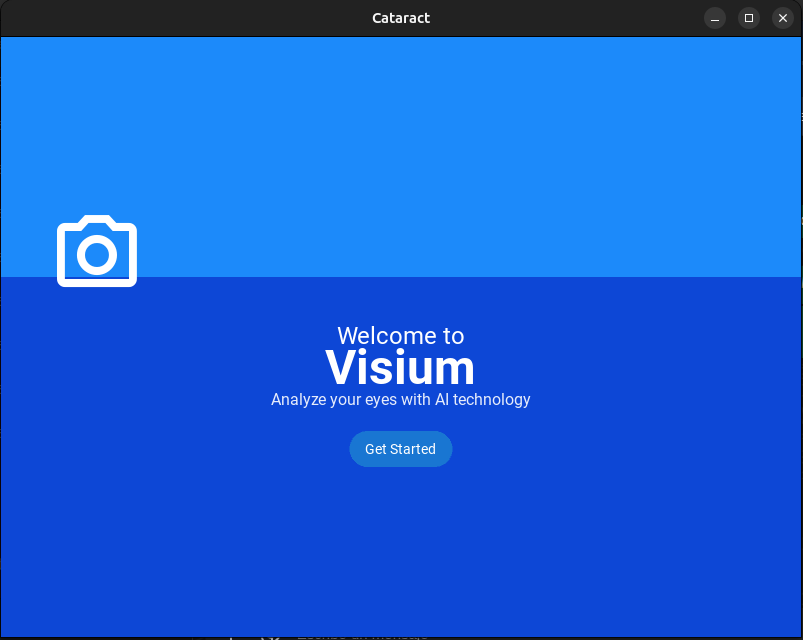
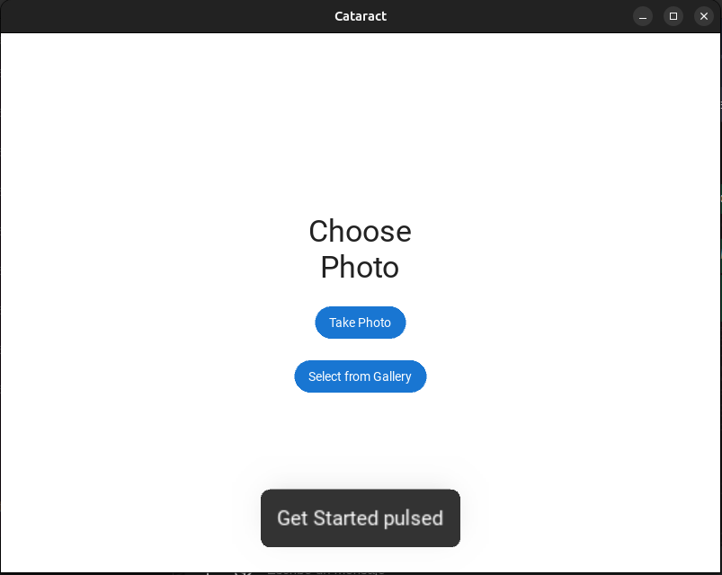
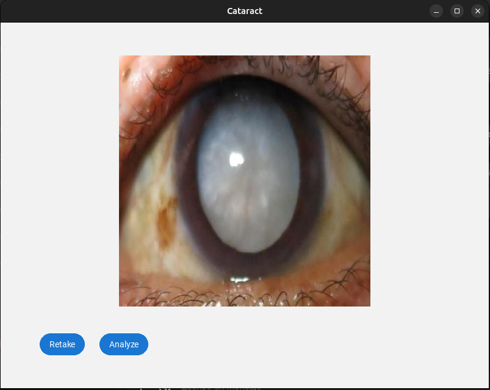
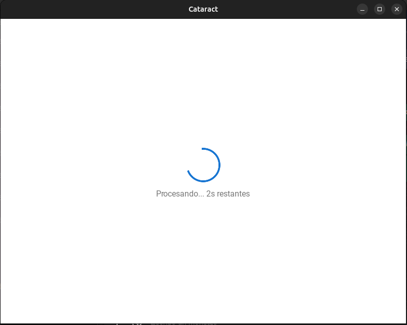
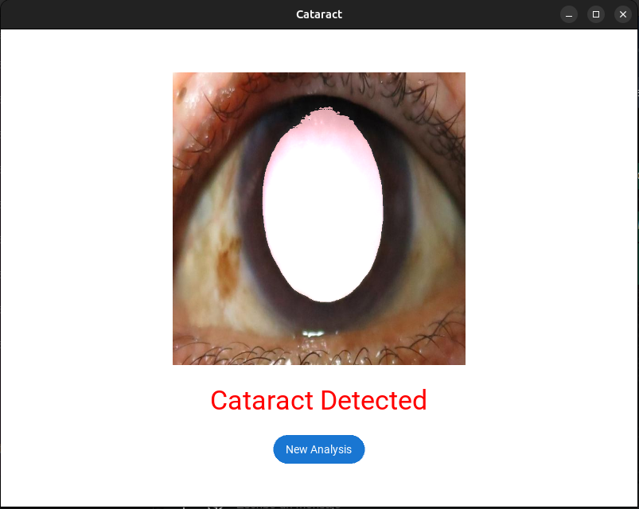

# **Reporte Semanal - Semana 1**  
**Fecha:** 12 al 18 de mayo de 2025  
**Autores:** Miguel Abreu y Samir Cabrera  

---

## **Resumen de Actividades**

Durante la semana comprendida entre el 12 y el 18 de mayo, se llevaron a cabo avances significativos en el diseño e implementación inicial de la aplicación. A continuación, se detallan las actividades realizadas:

### **1. Diseño de la Aplicación**
- Creación del diseño preliminar de la interfaz de usuario.
- Implementación del diseño en código utilizando la herramienta **Kivy** con el lenguaje de programación **Python**.
  - Kivy fue seleccionada por su versatilidad en el desarrollo de aplicaciones tanto para entornos web como móviles (iOS y Android).

### **2. Investigación Técnica**
- Revisión y análisis de documentación relevante para la virtualización y despliegue de la aplicación en dispositivos iOS y Android.

### **3. Configuración del Proyecto**
- Creación del repositorio del proyecto en GitHub.
- Definición de herramientas y tecnologías a utilizar en el desarrollo.

Repositorio del proyecto:  
🔗 [https://github.com/TheBug95/aplication-cataract-detector](https://github.com/TheBug95/aplication-cataract-detector)

---

## **Diseño Implementado**

Se implementaron las siguientes secciones iniciales de la interfaz:

- **Portada**

- **Menú principal**

- **Funcionalidad para tomar foto**

- **Procesamiento de la imagen**

- **Pantalla de resultado**

> *Nota:* El diseño actual es preliminar y está sujeto a mejoras. Elementos como los títulos, estilos y colores podrán ser ajustados en futuras versiones.

---

## **Requerimientos Pendientes**

- **[ ]** Marisse: Por favor enviar los **logos de la empresa** para integrarlos en la aplicación.

---

## **Observaciones Finales**

El equipo continuará con la implementación de funcionalidades clave durante las próximas semanas. Se realizarán pruebas en diferentes dispositivos y se continuará con la mejora del diseño, optimización del código y la integración de elementos gráficos proporcionados.
